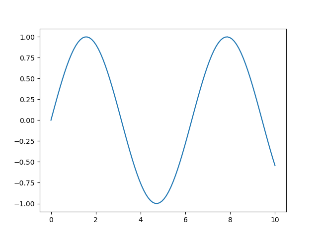

#+TITLE: A test note
#+DESCRIPTION: This is a test note for my rendering system.

* Testing code blocks and images

#+begin_src python
import numpy as np
import matplotlib.pyplot as plt

x = np.linspace(0, 10, 100)
y = np.sin(x)
plt.plot(x, y)
plt.savefig('figures/sine_wave.png')
#+end_src

This is a figure saved to the =figures= folder.

To update the page, do ~python -m build~.
